# IXC Softswitch — Key Features

- **High Capacity**: Supports up to 4,000 VoIP channels per server with CPS up to 800 and unlimited horizontal scalability.
- **Intelligent Routing**: Advanced algorithms including LCR, ACD/ASR, PDD, priority, percentage-based, and A-number/B-number routing. Supports for inheriting and time-based routing.
- **Protocol Flexibility**: Fully deployable in SIP and H.323 networks with protocol transcoding and SMS (SMPP 3.4) support.
- **Access List**: Built-in allow/deny numbers list management module, with auto adding/reseting feature.
- **Route Quality Control**: Automatic route tester with live voice recordings to monitor provider quality and detect FAS.
- **Comprehensive Codec Support**: Compatible with all major VoIP and GSM codecs with real-time transcoding.
- **Integrated Security**: Proprietary SIP firewall preventing SIP spam and unauthorized access.
- **Extensive API Integration**: Ready-to-use JSON API for external applications (includes Telegram bot support).
- **Flexible SIP Profiles**: Customizable profiles for any SIP rfc call scenario.
- **CPS Limitation Module**: Traffic can be rejected during overloads for unnecessary SIP attempts, without affecting real traffic.
- **Automated Billing**: Financial invoices and bills are generating automatically.
- **Modern Web Interface**: Intuitive UI with detailed financial, operational, and management reports, with  dark/light theme
- **Automated Rate Management**: Automatic rate upload and distribution directly from an IMAP mail server, with notification to Telegram bot
- **Traffic Monitoring**: Continuous traffic quality monitoring and alerting.
- **Call Routing History**: Allow to check call routing (callpath) at CDRs report.
- **Customer Portal**: Real-time active calls and reports overview for clients.
- **Testing Tools**: Built-in SIP generation utility for test any kinds of scenarios.
- **Data Protection**: Automatic backup system and two-factor authentication for enhanced security.
- **24/7 NOC Support**: Live multilingual support (EN, RU) available around the clock.

---

## 1. Main Page

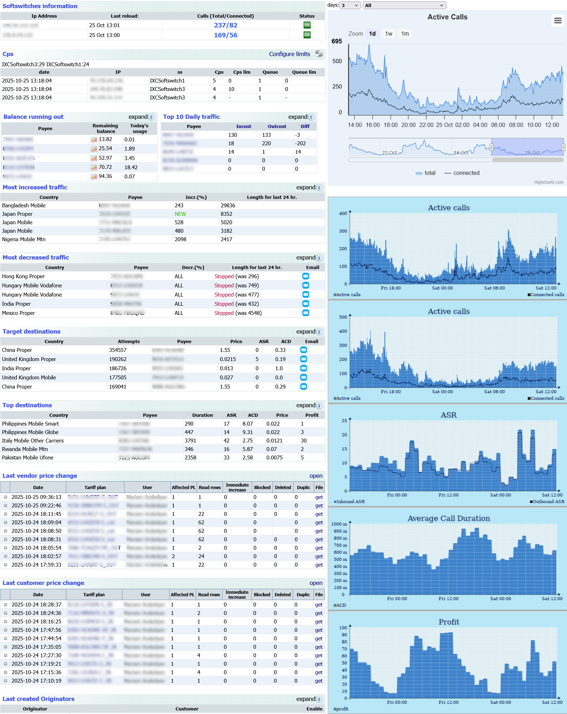

### Left Side

- **Softswitches Status**: Display the current status of all softswitches, including their total and connected calls in real time.
- **CPS (Calls Per Second)**: Show CPS per IP for each softswitch with the ability to set and adjust individual CPS limits.
- **Customers with Low Balance**: List customers whose balances are running low, including their current balance, consumption rate, and remaining amount.
- **Top 10 Daily Traffic**: Show the top 10 traffic records of the day, grouped by incoming and outgoing calls.
- **Most Increased Traffic (Last 24 Hours)**: Highlight destinations with the highest traffic growth during the last 24 hours.
- **Most Decreased Traffic (Last 24 Hours)**: Highlight destinations with the biggest drop in traffic during the last 24 hours. Allows sending warning emails immediately.
- **Target Destinations**: Display destinations with highest number of call attempts and lowest quality.
- **Top Destinations**: Highlights destinations offering the best call quality.
- **Recent Price Changes**: Display the last changes at terminator/originator prices, including full details such as date, prefix, old/new price, and who made the change.
- **Recently Created Peers**: List the latest created terminator and originator points with their key details.
- **Active Web Sessions**: Show currently active web sessions with user, IP address, and session time information.

### Right Side

- **Dynamic Graph of Active Calls**: A live, real-time graph showing total and connected active calls with the ability to filter by various criteria.
- **Static Graph of Active Calls per Softswitch**: A fixed graph showing the distribution of active calls across all softswitches.
- **Static Graphs of ASR, ACD, and Profit**: Clear visual charts displaying the overall ASR,ACD  and profit trends over time.

---

## Traffic flow report:

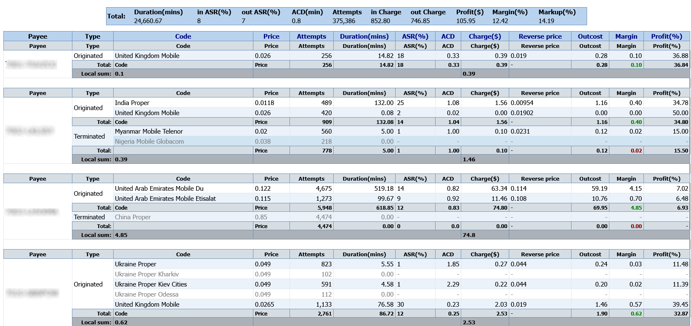

Traffic flow report shows general stats of customers/vendors traffic groupped by destinations at one page. It has various kind of filters and sorting. Each row included link for detail call stat for selected destination. Report allows to use color filter rules for highlighting rows with different colors and desired criteria

## Originator/Terminator calls report:

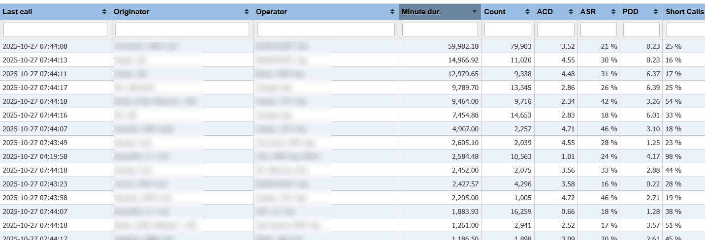

Main Calls Report: Provides advanced filtering and grouping tools for in-depth call analysis. Data can be grouped by hour, day, or week, with detailed information on the destination operator. The flexible interface supports filters by A-number/B-number mask, call duration, profit, PDD, disconnect initiator, and more. Additional features include custom templates, color rules, automatic refreshing, and export to XLS or CSV.

### Call routing history:

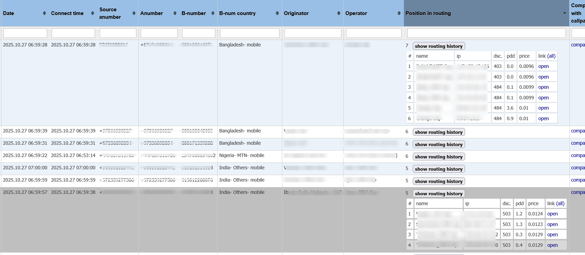

Selecting “Calls” in the report enables viewing routing history. The report shows the route that successfully handled each call and details all routing attempts, including disconnect codes and PDD. Direct links to full reports of rejected attempts allow for thorough analysis.
 

## Variation report (Traffic trend):

 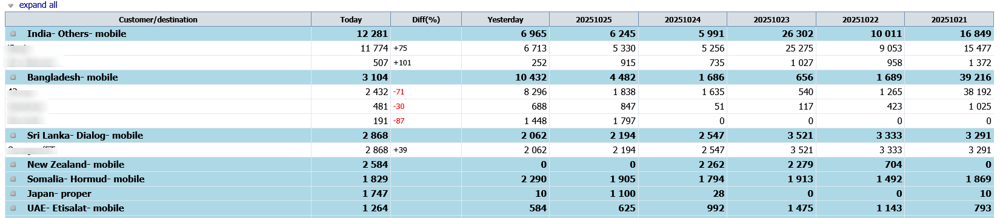

Variation Report: Displays traffic variations in both absolute and relative values over recent days, weeks, or months, grouped by destination or customer. The form provides options to filter by traffic trend (increase or decrease) and define a custom percentage difference threshold.

## Access list (known as White/Black list):

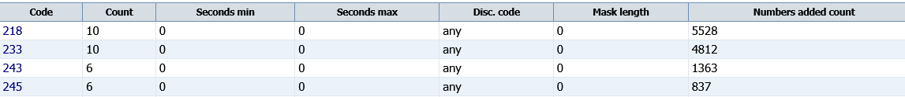

Sim blocking is one of the main problems of GSM termination business. In many countries, mobile operators and providers block GSM Gateways. This affects the overall business and revenues of terminating companies. To help solve this issue, IXC has developed an Access List module. 
IXC Access List enables routing specific numbers via selected carriers (terminator/originator). The numbers can be uploaded by the user and then can be auto-updated by the system based on desired criteria. They can be autodeleted after preconfigured expiration date.
You can configure IXC Access List to work with either whitelists, or blacklists.

- **Access list Whitelist Scenario**:

You can create a list of allowed numbers to be routed via selected carrier  . All the other numbers, except for the mentioned ones, will not be routed via selected carrier but will be routed via remaining terminators listed in failover scheme. White list is built based on called numbers (CLD) and/or caller IDs (CLI/ANI numbers).

- **Access list Blacklist Scenario**

You can create a list of restricted numbers, which will not be routed via selected terminator, except for the numbers outside of the list. This tool is helpful in cases when anti-fraud companies send ongoing test calls to same numbers.

## Balance report :

  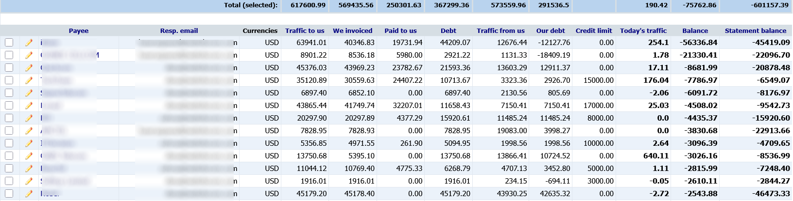

Customer Balance Report: Provides a complete financial overview for each customer — covering incoming and outgoing traffic, invoices, payments, debts, credit limits, and real-time balance updates. Clicking on customer will open  lists all financial transactions (invoices, payments, credits, etc.)

## Agreements/Commitments :

  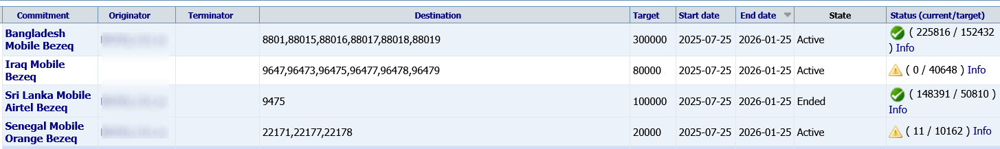
  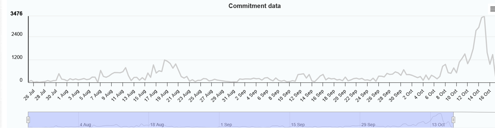

Commitment Menu: Allows creating commitments with target traffic volumes for a selected date range and destination. Traffic amounts are calculated daily, and automatic reminders are sent if targets are not met. Each commitment can be analyzed manually using a traffic graph.

## Profit report:

 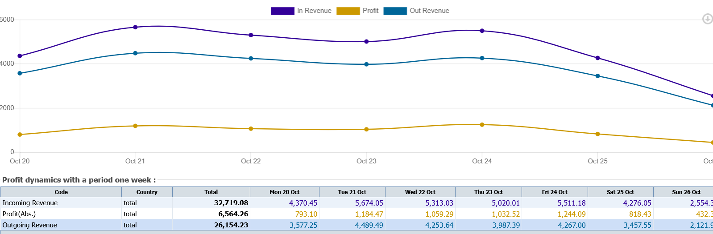

Profit Report: Shows profit and volume metrics in a graphical format, with grouping options by different periods and filters for specific destinations or customers.

## Invoices/bills:

 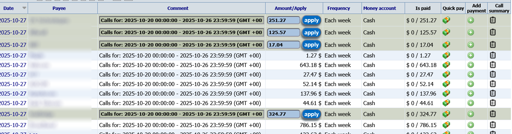

Invoices and Bills: Invoices are automatically generated and sent to customers in their time zone at the end of each billing period. Bills are pre-generated in the system in a “pending” state. Once a bill is received from a vendor, the pending entry can be applied, applied and paid, or rejected if the amount does not match.

## Auto Rate uploading:

 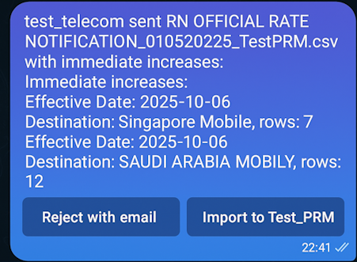
 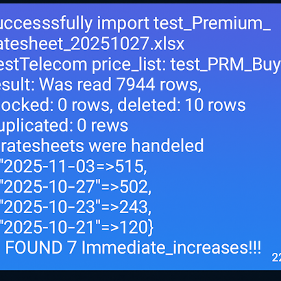

Once a price template is created for each customer, it becomes possible to automatically upload rates to required trunk directly from the mail server. If an immediate rate increase is detected, there are two options: either send an additional confirmation message with a summary of the increased codes to the Telegram bot, or decline the rate. After the upload or rejection, an automatic email is sent to the vendor notifying them about the result.

## Live balance checks

 

All customer calls are checked by an intelligent algorithm to ensure balances do not exceed the allowed credit limit. If the limit is reached, notifications are sent, and the account is automatically restricted. The assigned manager receives a Telegram alert with a quick option to top up the customer’s balance and continue service without interruption.

## Routing rules:

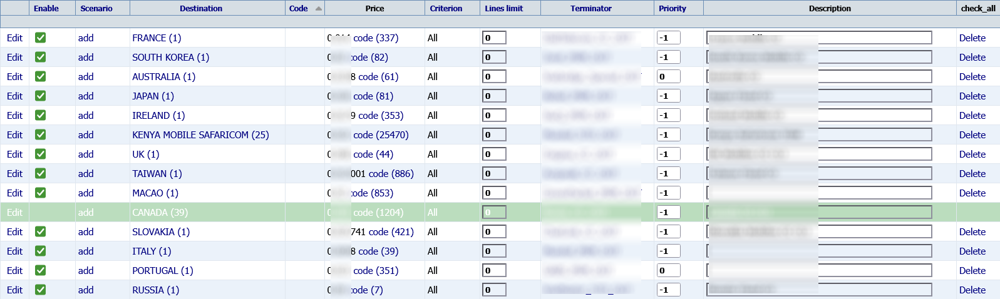

Routing Table: Provides a complete view of all routing rules for a specific originator, including criteria, price, and priority. Rules can be inherited from other tables, avoiding data duplication. Built-in scenarios enable scheduled opening, closing, or switching of routes. Supports bulk operations, such as mass additions/removals or CSV import/export.

## Current Routes 

 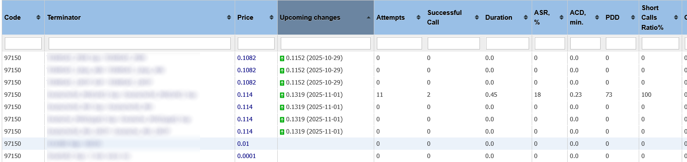

Current Routes Tool: Allows analyzing routing information for any selected destination. It displays all available suppliers with their rates, traffic volumes, and quality metrics. The tool also shows pending rate increases, helping to plan selling rates for each destination.

## IXC Monitoring Tool:

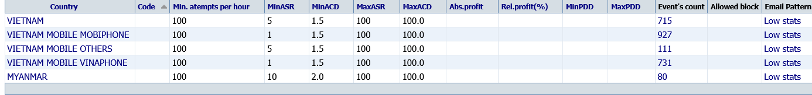
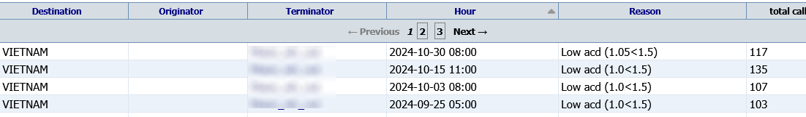

We understand how important it is for every company to monitor connected calls and ensure their quality.
The IXC Monitoring Tool enables real-time traffic analysis, tracking key performance metrics such as ASR, ACD, PDD, and Profit.

The system continuously checks these parameters and compares them to defined thresholds. When any value deviates from the desired range, the tool triggers an alert based on customizable rules.
Rules can be applied to both originators and terminators, with flexible configuration options.

All events are logged in the database and can be analyzed later.
The system can automatically generate email alerts (with configurable templates) or Telegram Bot notifications, and — if necessary — perform automatic blocking of the affected route.
It can also send automated Trouble Ticket emails directly to suppliers for faster issue resolution.

##  IXC Autotester:

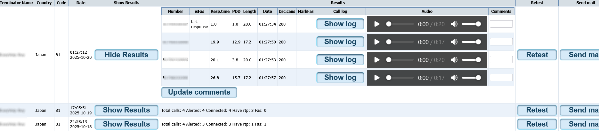

IXC Autotester is a fully automated solution for testing multiple routes and destinations.
It helps improve route quality by detecting poor-performance connections and providing detailed insights into both existing and new interconnections.

The tool automatically records test calls in MP3 format, allowing recordings to be easily attached to email notifications or reviewed directly in the web interface.

Traditionally, interconnection testing requires significant manual effort. With IXC Autotester, the process takes only a few clicks. Simply select the desired vendor and destination — the system will automatically initiate the test. You can even schedule recurring tests, ensuring continuous route monitoring.

Test results can be automatically delivered to specified email addresses for fast review and action.

IXC Route Autotester supports both SIP and H.323 protocols, as well as all major codecs, including G.711, G.723, and G.729.
During testing, the tool generates real RTP media streams, recording each call for accurate analysis. Audio files can be played directly from the interface or downloaded locally for further examination.

## 24/7 NOC Support

 

We have been providing 24/7 support for over 25 years. Our experienced team is always ready to help you with any questions. We are open to your feedback, suggestions, and ideas.

